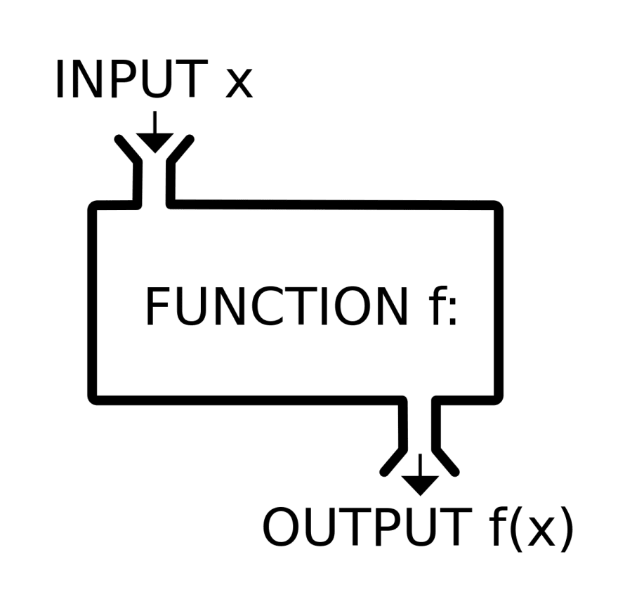

Lesson 4: IPO Model
===================

	

## TL; DR
**IPO** stands for **input**, **process**, and **output**. ito ang tatlong steps na bumubuo sa **Data Processing Cycle** na kung saan nagiging meaningful information ang raw data that we currently have. 'Pag na-gets mo to, sa'yo na magpapaturo mag-program ang crush mo, GARANTISADO.

## Overview
Data processing is the re-structuring or re-ordering of data by people or machine to increase their usefulness and add values for a particular purpose. Data processing consists of the following basic steps - input, processing, and output. [(source)](https://www.tutorialspoint.com/computer_fundamentals/computer_data.htm)

The input–process–output (IPO) model is a widely used approach in systems analysis and software engineering for describing the structure of an information processing program or another process. Many introductory programming and systems analysis texts introduce this as the most basic structure for describing a process.[(source)](https://press.rebus.community/programmingfundamentals/chapter/input-process-output-model/)

## Further chika
I remember when i was a freshman IT student at nagsisimula palang mag-aral ng programming, talagang confused ako sa mga pinagtuturo ng prof namin sa programming. Isa lang ang nasisiguro ko noong mga panahon na yon: *Everything doesn't make sense*.

That was until i've learned about this concept, sobrang laki ng ambag nitong concept na to na kahit hanggang ngayon sa trabaho naka-align dito yung paraan ng pagdedesign ko sa program or codes ko.

Introducing the **IPO Model**. Ang **IPO Model** ang bumubuo sa tatlo (3) steps ng **Data Processing Cycle**. Ang **Data Processing Cycle** naman ay ang pagsasaayos ng data nag maaring gawin ng tao or ng machine upang mas maging meaningful at kapakipakinabang ang data na ito.

**Ang IPO Model ay binubuo ng tatlo (3) steps**:

- **INPUT** -- sa step na ito, inihahanda or pini-prepare ang data na gagamitin natin or ipa-process natin. Examples would be reading the data from a data source (storage devices, database), parsing the data into their proper data types, or properly declaring containers for the incoming data from a data source.

- **PROCESS** -- sa step na ito, from the name itself, pino-proseso ang input (data) na mayroon tayo sa paraan na kinakailangan natin. Examples would be calculating average grade, rendering shapes into a canvas, producing summary of sales. etc.

- **OUTPUT** -- ito ang last step ng Data Processing Cycle, ito yung data or information na naproduce mula sa process na ginawa natin kanina. 

**TAKE NOTE**: **Data Processing CYCLE** ang tawag dahil itong **IPO Model** ay maaring umulit depende sa pangangailangan mo. Medyo magulo pa? chill ka lang let's see more examples.

In deciding no how to write a program, one must understand that every computer program or any sort of process follows this principle, the **IPO**, to produce meaningful result.

Example pseudocode 4.1:

	// let's say balak mong gumawa ng program
	// na nagcocompute ng average grade ng isang student
	// we will follow the IPO model
	// First, let's think of the INPUT
	// the INPUT na gagamitin natin is of course, yung grades ng student
	// duhhh, we are making an average-grade-calculator programm
	// how can it be useful if we don't have data to work with, right?
	
	// INPUT
	DECLARE Array:integer variable grades
	DECLARE float variable averageGrade
	ASSIGN grades = [89, 97, 91, 96, 83]
	
	
	// Kung napapansin nyo sa pseudocode natin, meron tayong 'Array' data type
	// Basically for now, ang 'Array' ay isang data type gaya ng 'integer' or 'string'
	// ang pinagkaiba lang is ang 'Array' ay list or collection of data
	// so now we have a 'Array:integer' in order to simply tell us na meron
	// tayong collection of integers, which is in this example the grades of the student
	// now let's think about the PROCESS
	
	//PROCESS
	Function computeAverage(...)
	
	// Let's pretend na mayroon tayong Function, or an Action na 'computeAverage'
	// ang 'computeAverage' natin ang magcocompute ng average ng grades natin
	// so now let's think of the OUTPUT
	
	//OUTPUT
	ASSIGN averageGrade = computeAverage(grades)
	
	// Now using our 'computeAverage' Function, ni-compute natin yung grades
	// then in-assign sa variable na 'averageGrade' para makuha yung output
	
	// And then remember, this is a CYCLE
	// yung OUTPUT natin kanina na averageGrade ay maaring maging INPUT sa susunod
	// nating cycle!
	
	saveToDatabase(averageGrade)	<- Sample Function that saves data to database

Medyo mahaba habang example yan dahil hinimay-himay natin ang bawat detalye. You can also check this diagram para mas mavisualize mo nang maiigi ang flow natin:

	

Get's mo na ba? kung hindi pa rin bahalakanajan, joke lang. Isipin mo nalang na ang isang program ay isang **LEGO piece**. Why LEGO? una, most of the time **ang malalaking bagay ay nagsisimula sa maliit**. Big processes ay binubuo ng small proccesses. Pretty much similar to LEGO pieces. Ang OUTPUT ng isang PROCESS ay maaring maging INPUT ng another PROCESS. This is why it's called **Data Processing CYCLE** dahil maaring umulit ang **IPO** hangga't kinakailangan mo.

| PROCESS 1 | PROCESS 2 | PROCESS 3 |
| --------- | --------- | --------- |
| `input` -> `process` -> `output` -> | `input` -> `process` -> `output` -> | `input` -> `process` -> `output`

## Summary para di na sumakit ulo mo
As much as i like to simplify it, just think of your programs/processes as a **LEGO piece** where you can stack and connect with one another. And it has three (3) parts/steps: **IPO** (**INPUT -> PROCESS -> OUTPUT**)

	

